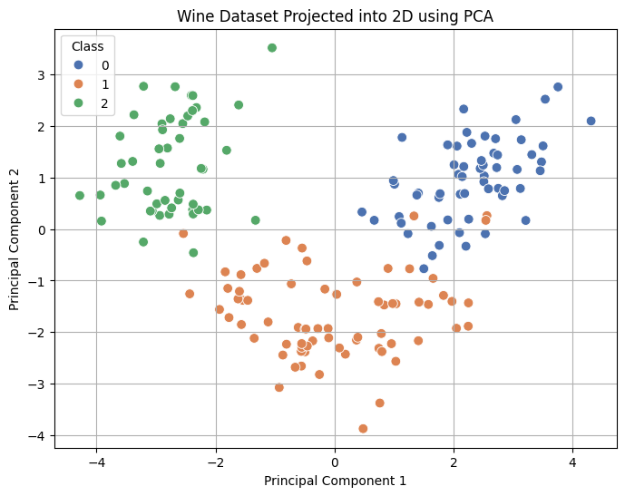
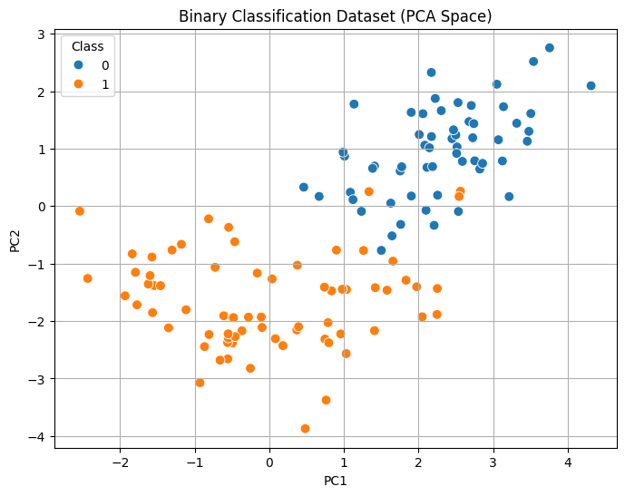
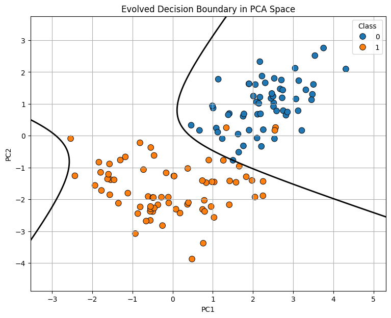
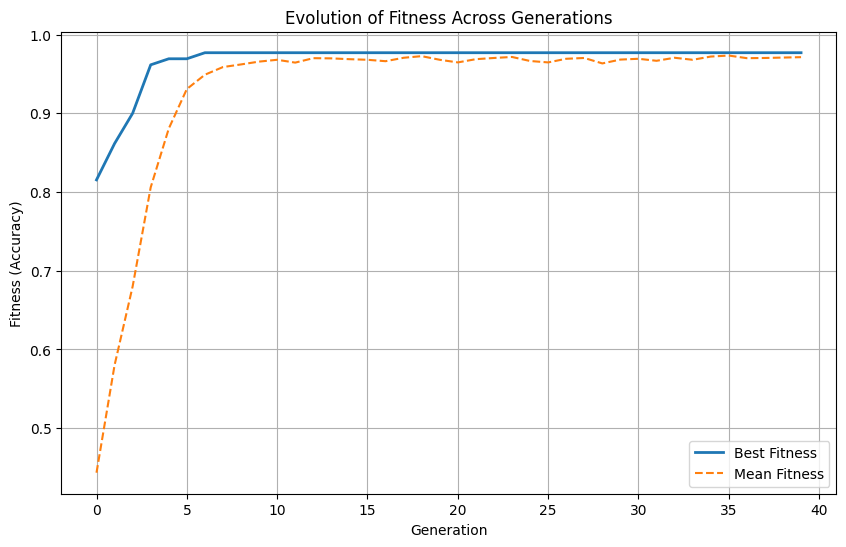

#  Natural Selection for Classifier


Short project description

---

##  Overview

Project explanation...

---

##  Methodology

1. Load Wine Dataset
2. PCA Projection
3. Genetic Algorithm
4. Evolve Decision Boundary

---

##  Dataset Visualization

The Wine dataset is projected into two dimensions using Principal Component Analysis (PCA) to visualize the separability of the classes.

<p align="center">
  
</p>

---

##  Binary Classification Dataset

The original three-class dataset is converted into a binary classification problem before applying the evolutionary algorithm.

<p align="center">
  
</p>

---

##  Evolutionary Decision Boundary

After multiple generations, the Genetic Algorithm evolves a classifier capable of separating the two classes.

<p align="center">
  
</p>

---

##  Evolution of Fitness

The figure below shows how the population improves over successive generations. The best fitness converges quickly, while the average fitness steadily approaches the optimum.

<p align="center">
  
</p>

---

##  Features

- Genetic Algorithm from scratch
- PCA visualization
- Binary classification
- Evolutionary optimization
- Fitness-based selection
- Decision boundary visualization

---

## 🛠 Technologies

- Python
- NumPy
- Pandas
- Matplotlib
- Scikit-learn

---

##  Getting Started

```bash
git clone https://github.com/sanchit020/natural-selection-for-classifiers.git

cd natural-selection-for-classifiers

pip install numpy pandas matplotlib scikit-learn
```

Run

```bash
jupyter notebook
```

---

##  Repository Structure

```
natural-selection-for-classifiers
│
├── natural-selection-for-classifiers.ipynb
├── README.md
└── images
    ├── wine_dataset.png
    ├── binary_classification.png
    ├── evolved_decision.png
    └── evolution_fitness.png
```

---


---

##  Author

**Sanchit Saini**
